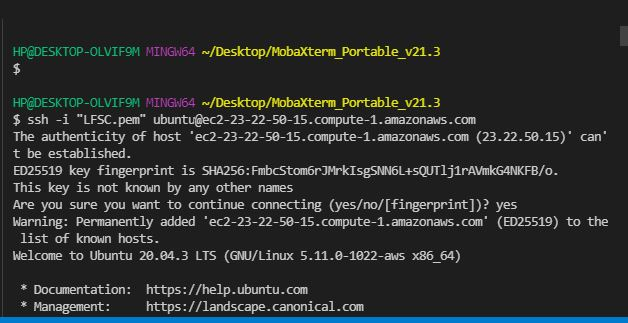
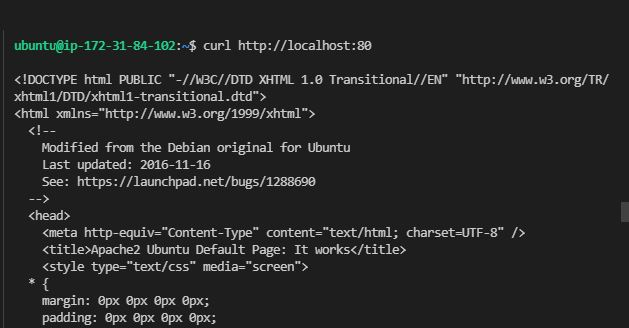

#Documentation for Project 1 - LAMP-STACK on AWS
- Step 1 -- Setup Servers on AWS 
    -  
   
- Step 2 -- Configure Security Groups
- Step 3  
    - a) Update packages -- `sudo apt-get update -y`

    - b) Upgrade system  -- `sudo apt-get upgrade -y` 
    
    - c) Install and configure apache2
      - 
      - 
    - d) View php info 
      - 
    - e) Acess Ubuntu Default Page 
      - 
    - f) Install and secure mysql 
      - 
    - g) Install php 
      - 
    - h) Create and configure virtual host for the project 
      - 
      - 

